# Lab 3 -- Copilot Cowork: Intelligent File Organizer

Estimated Time -30 minutes

Apps -Copilot Cowork, OneDrive, SharePoint, Excel, Microsoft Teams

## Lab Objectives

By the end of this lab, you will be able to:

- Classify and rename enterprise files using AI-generated naming
  conventions

- Apply the YYYY-MM-DD_Topic_DocType rename convention across an entire
  OneDrive folder

- Execute a full governance audit covering duplicates, staleness,
  sharing risks, and ownership gaps

- Use human-in-the-loop approval gates before every bulk file operation

- Generate an Excel governance tracker and post a Teams summary from a
  single instruction

- Reorganise HR documents into category subfolders with a
  department-aware naming scheme

- Apply responsible AI principles --- understanding which governance
  actions require human approval

## Lab Scenario

You are a Power User or IT Administrator at Zava Retail, overseeing a
shared OneDrive environment containing 28 mixed files across retail, HR,
finance, and project folders. File naming is inconsistent, governance is
weak, and a compliance review is approaching.

You will use Microsoft 365 Copilot Cowork --- an agentic AI layer that
orchestrates OneDrive, SharePoint, Excel, and Teams --- to classify,
rename, audit, report on, and reorganise these files. Every bulk action
requires your explicit approval before it executes.

## Lab prerequisites

Complete the following setup steps before starting the lab (estimated:
15--20 minutes):

- Required Microsoft 365 Environment

- Microsoft 365 Copilot with Copilot Cowork enabled

- Microsoft Teams with permission to post to channels

- OneDrive for Business and SharePoint Online

- Microsoft Excel (Web or Desktop)

- Microsoft Graph-connected M365 tenant

- Required OneDrive folder structure

- Create a Lab Files folder in OneDrive with these four subfolders:

- Lab Files / HR --- upload provided HR document samples

- Lab Files / Retail --- upload provided retail document samples

- Lab Files / Shared Files --- configure \'Anyone with the link\'
  sharing on at least 3 files

- Lab Files / Archive Candidates --- optional pre-populated stale
  documents

- Required Teams environment

- Team: Zava Retail (or equivalent)

- Channel: General (Standard) --- target for Exercise 3 Teams post

## Exercise 1 -- Automated file classification and renaming

Task 1: Create the SharePoint site

1.  From a new browser, navigate to
    +++<https://m365.cloud.microsoft/chat/+++>  and login with your lab
    credentials.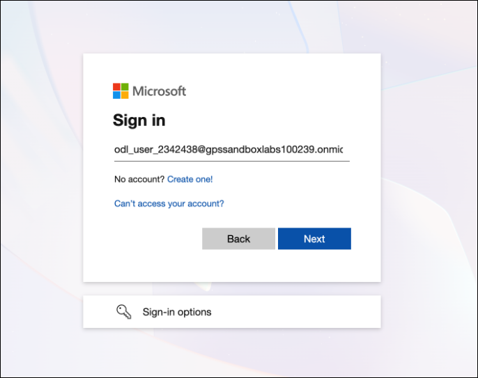{width="4.75in"
    height="3.7604166666666665in"}

2.  Enter the password and click **Yes**, to stay signed in.

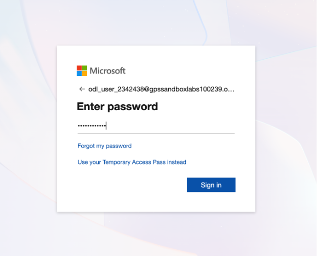{width="4.5in" height="3.6354166666666665in"}

3.  Select **Apps** from the left pane and then
    select **SharePoint** once the Apps are loaded.

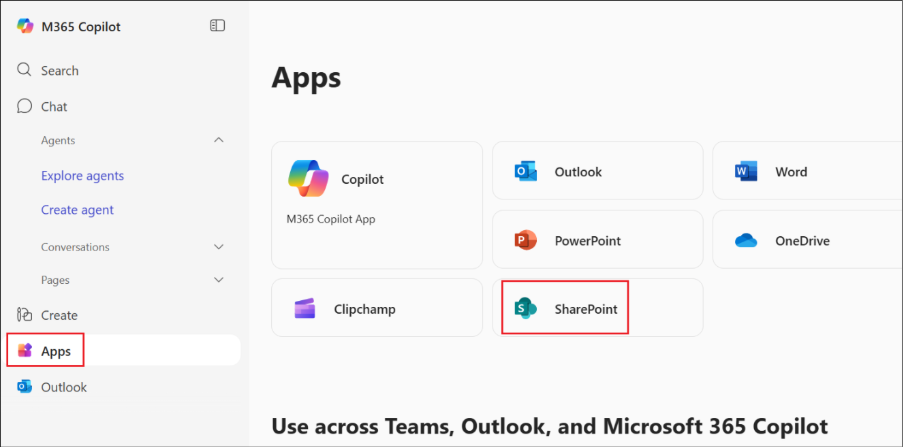{width="6.270833333333333in"
height="3.1041666666666665in"}

4.  Select **+ Create site** from the SharePoint page.

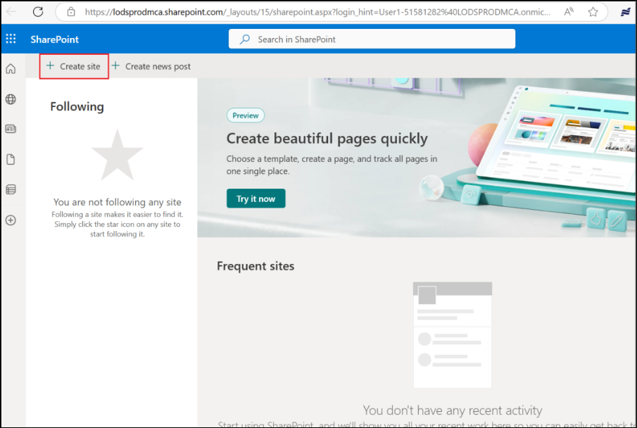{width="6.270833333333333in"
height="4.208333333333333in"}

5.  Select **Communication site** from the **Select the site
    type** page.

{width="6.270833333333333in"
height="3.6875in"}

6.  Select a **template** to be used.

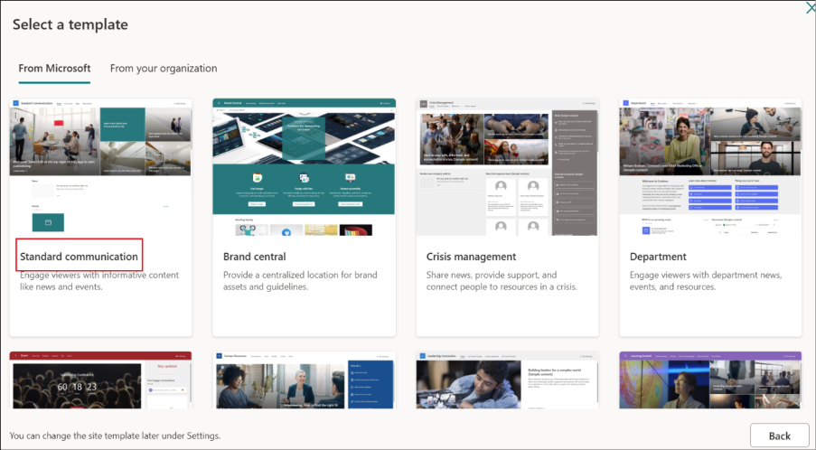{width="6.270833333333333in"
height="3.4583333333333335in"}

7.  Select **Use template**.

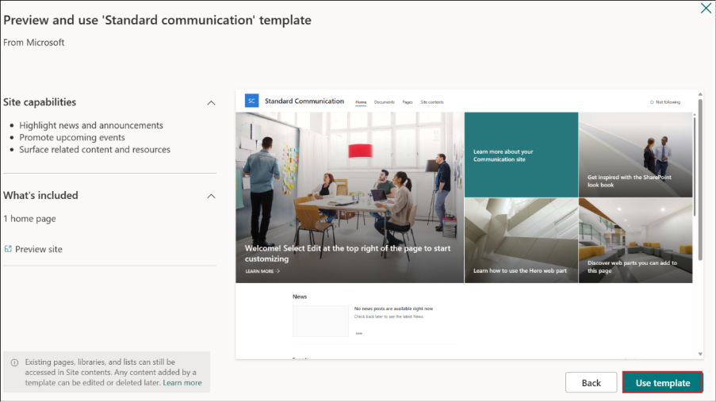{width="6.270833333333333in"
height="3.5208333333333335in"}

8.  Set up your site by pasting your site name as +++Zava Site+++.
    Select Create Site.

{width="6.5in" height="3.6875in"}

9.  Upload the following files in the Document center:

- Active Candidates folder

- HR folder

- Retail folder

- Shared files folder

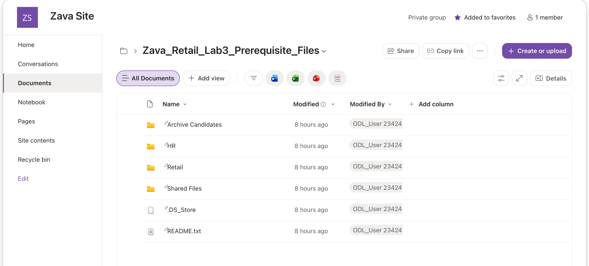{width="6.5in" height="2.9479166666666665in"}

Task 2: File Classification and renaming

1.  Open your browser and navigate to +++m365.cloud.microsoft+++. Sign
    in with your lab account.

2.  After successful login, you will see **Copilot Chat** home page.
    Select the Microsoft 365 Copilot app from the launcher. Click the
    \'Cowork\' tab at the top of the left sidebar --- NOT the \'Chat\'
    tab.

{width="6.5in" height="2.34375in"}

3.  In the Cowork chat box, paste the following classification prompt,
    and select, then click the blue ↑ send arrow on the right side of
    the box:

*+++* *Analyze the files in the \"Documents\" library on the Zava
SharePoint site. Classify each by type and topic, then propose a
renaming scheme of the form YYYY-MM-DD\_\<Topic\>\_\<DocType\> based on
each file\'s content and metadata. Show me the full old-name → new-name
mapping before renaming* *anything.+++*

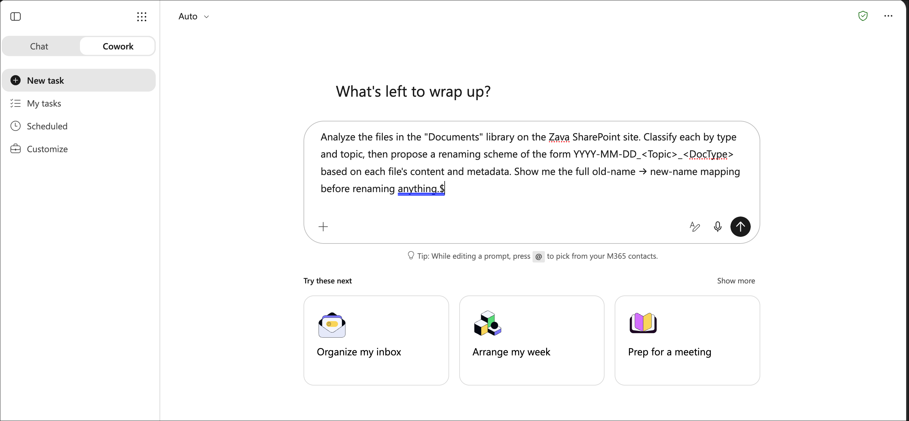{width="6.5in"
height="3.0104166666666665in"}*4.* After content analysis, Cowork
produces the full old-name → new-name mapping table and stops --- it
will not rename anything until you approve.

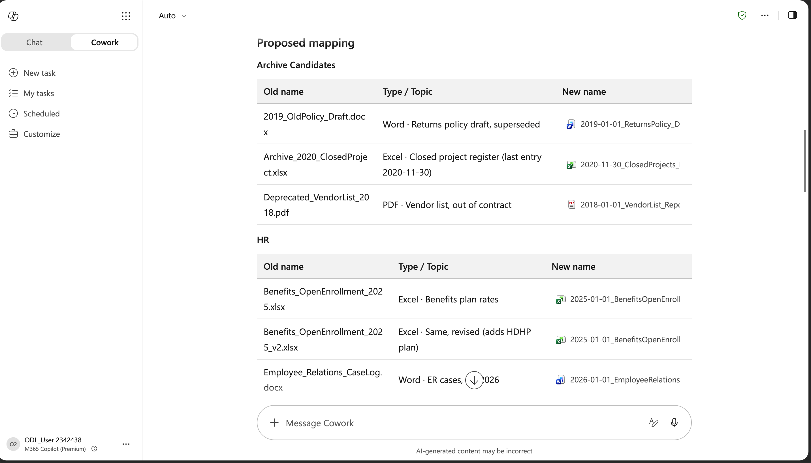{width="6.5in" height="3.7083333333333335in"}

IMPORTANT: The message input box has returned to \'Message Cowork\' ---
Cowork has STOPPED. NO changes have been made in OneDrive yet. This is
the Human-in-the-Loop preview gate.

### Task 2: Creating a new folder

1.  In the message box, paste the following prompt and select execute
    button:\
    *+++Proceed with suggesting renaming and create new folder for all
    latest renamed files+++*

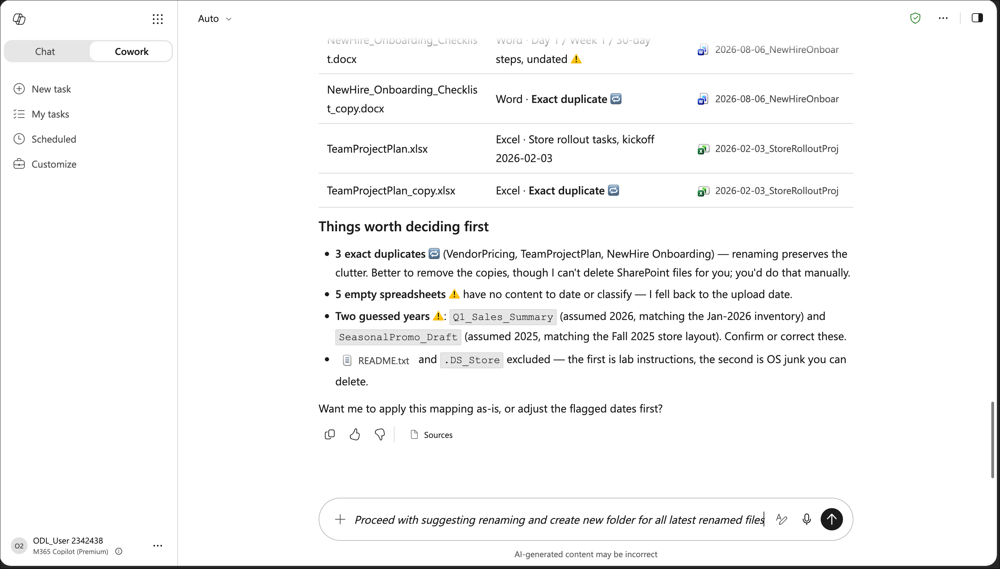{width="6.5in" height="3.6979166666666665in"}

2.  Cowork would ask you to edit the name. Once done, select +Create.\
    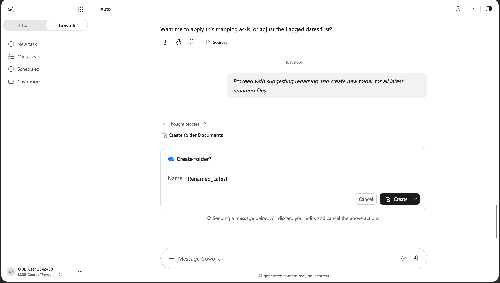{width="6.25in"
    height="3.5416666666666665in"}

3.  Cowork would ask you to approve the names for all the files. Click
    Approve All.

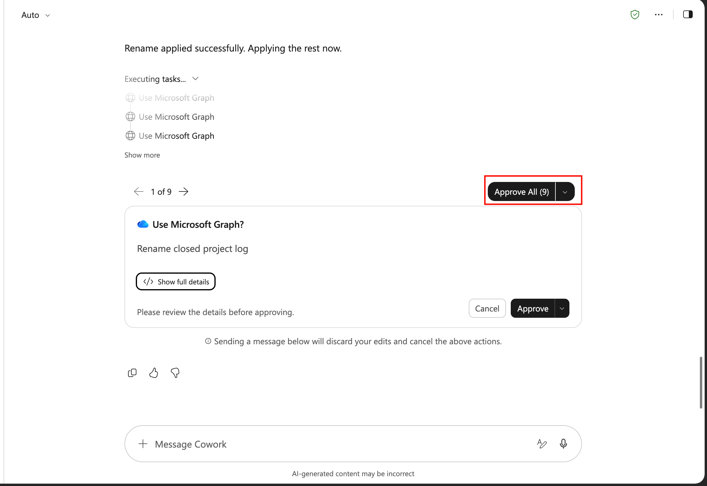{width="6.5in" height="4.46875in"}

4.  Review the output:\
    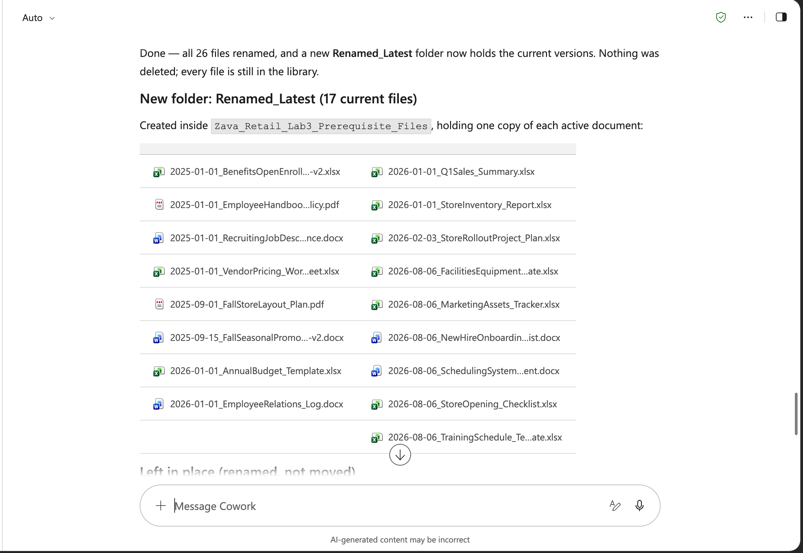{width="6.25in" height="4.3125in"}

## Exercise 2 -- OneDrive and SharePoint governance audit

Audit the Lab Files folder for governance issues --- duplicate files,
stale content, external sharing risks, and ownership gaps. Produce a
structured audit report with recommendations, then execute one approved
governance action.

### Task 1: Submit the governance audit prompt

1.  In the Cowork chat box, paste the following prompt:

*+++Audit my \'Lab Files\' folder for governance issues: duplicate
files, files not modified in over 6 months, files shared externally or
with \'anyone\' links, and files with no clear owner or topic. Recommend
an action per finding (archive, delete, restrict sharing) but take no
action* *yet.+++*

{width="6.5in"
height="3.6666666666666665in"}

2.  Review the output:\
    {width="6.25in"
    height="3.5356572615923008in"}

### Task 2: Review the Audit Report

1.  READ Section 1 --- Duplicate files 🔴 (biggest issue): 3 exact
    duplicates identified by byte-identical content hash and 2 versioned
    near-duplicate pairs.\
    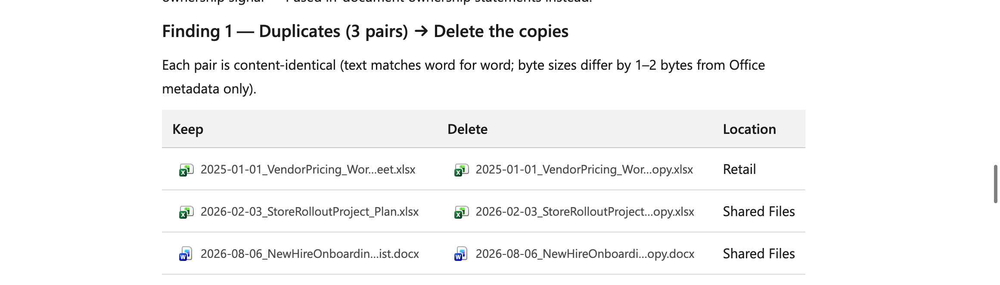{width="6.25in" height="1.78125in"}

2.  READ Section 2 --- Stale files ⭕: files identified as archive
    candidates based on filename-embedded dates (metadata dates were
    updated by the Exercise 1 renames).

{width="6.5in"
height="1.0520833333333333in"}

3.  READ Section 3 --- External shares ✅: all 28 files show owner-only
    permissions (CLEAN --- no action needed).

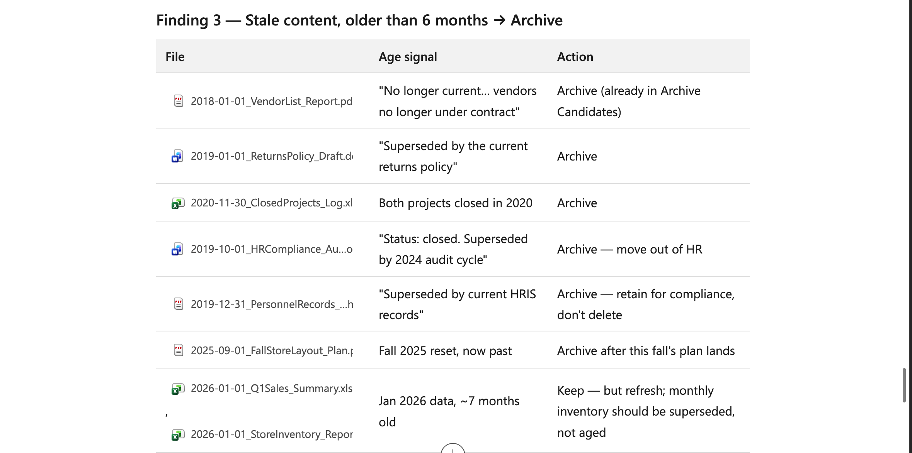{width="6.5in"
height="3.2291666666666665in"}

4.  READ Section 4 --- No clear owner 🟡: LegacyPolicy and all 13 empty
    .xlsx placeholder files flagged.

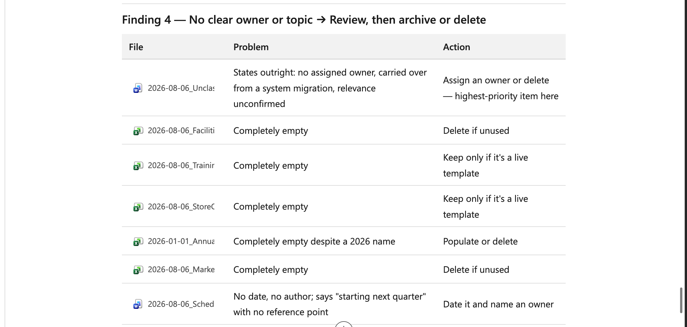{width="6.5in"
height="3.1041666666666665in"}

5.  READ the \'Suggested next steps (on your go-ahead)\' numbered action
    menu at the bottom.{width="6.25in"
    height="1.75in"}

### Task 3: Execute one governance recommendation

1.  In the message box, type: \'2\' (to approve action #2: archive the
    2024/2025/legacy items) and click Execute button.

*Note: Cowork executes ONLY action #2. Actions #1, #3, #4, and #5 remain
pending --- approval of one does not authorize it all.*\
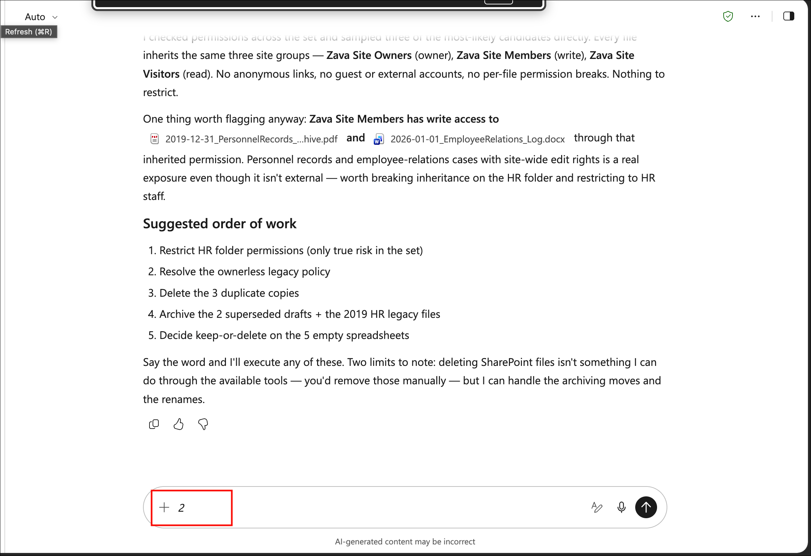{width="6.5in" height="4.458333333333333in"}

2.  Cowork puts forth 4 option "How should I resolve the ownerless
    legacy policy?" Select option 1: Move to Archive Candidates.

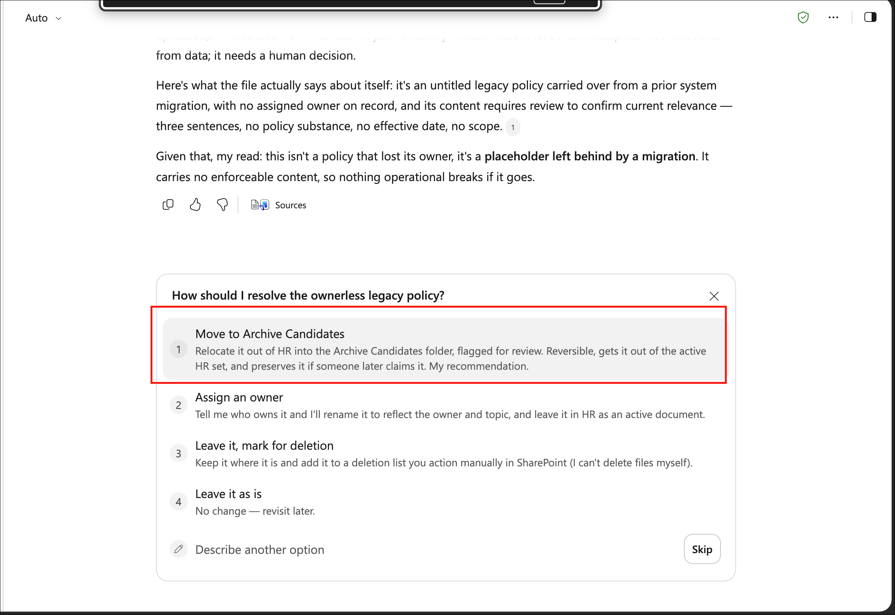{width="6.5in" height="4.46875in"}

3.  An approval prompt pops-up asking for your approval. Select Approve.

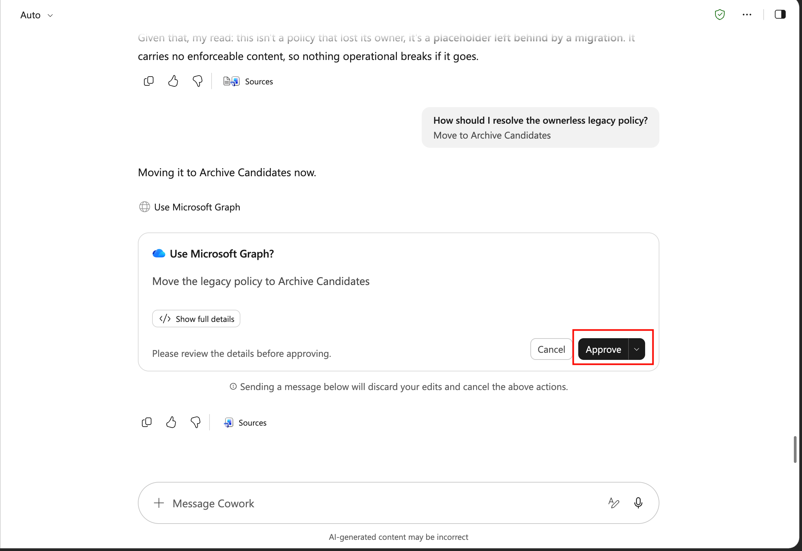{width="6.5in" height="4.479166666666667in"}

*Note: Cowork\'s autonomy boundary: \'Safe without approval\' =
read-only analysis only. \'Needs human approval\' = any action that
changes state.*

## Exercise 3 -- AI-generated Excel tracking and Teams reporting

Generate an Excel governance tracker with one row per file, then post a
3-line summary to Teams with a workbook link --- demonstrating OneDrive
→ Excel → Teams cross-app workflow orchestration from a single
instruction.

### Task 1: Submit the Excel and Teams prompt

1.  In the Cowork chat box, paste the following prompt and select
    Execute button:

+++*Create an Excel workbook \'File Governance Tracker.xlsx\' in Lab
Files with one row per file: name, type, topic, last modified, sharing
status, action taken. Then post a 3-line summary of today\'s cleanup to
my Teams channel with a link to the* *workbook.+*++

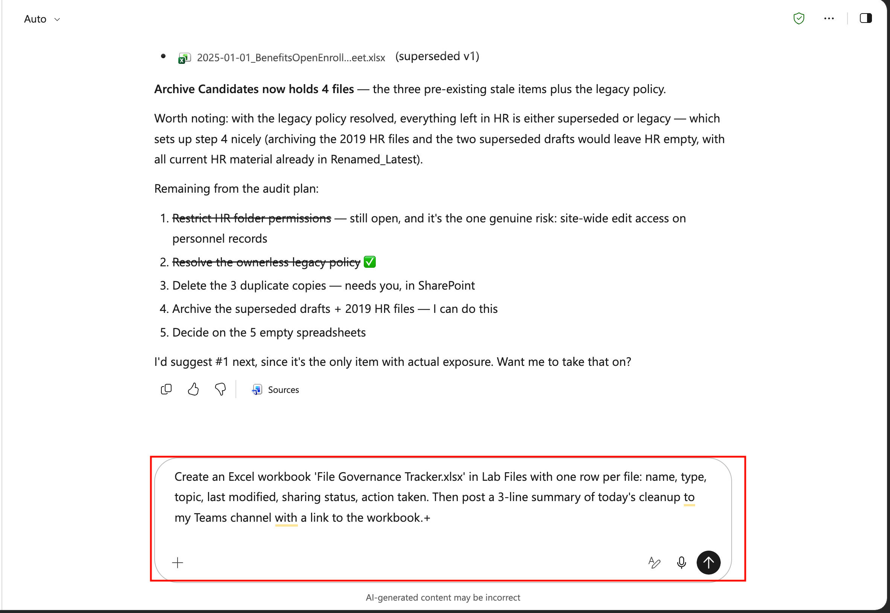{width="6.5in" height="4.489583333333333in"}

2.  An approval prompt opens up asking for approval for the drive.
    Select Approve.

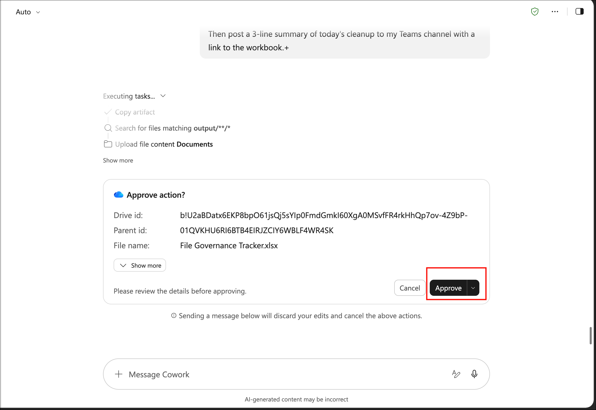{width="6.5in" height="4.479166666666667in"}

3.  Open the File Governance Tracker.xlsx from the Workspace Output
    panel link. Verify: 28 rows (one per file), 6 columns (File Name,
    Type, Topic, Last Modified, Sharing Status, Action Taken).

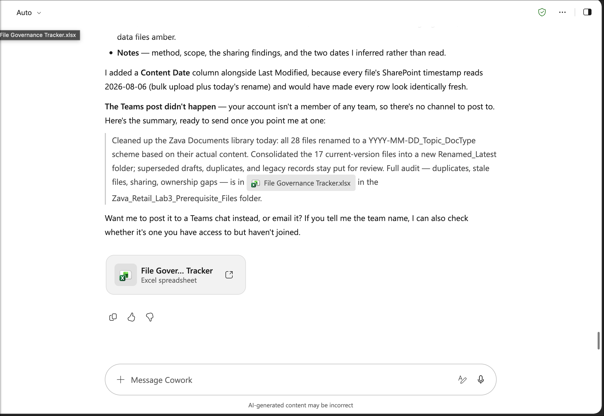{width="6.5in" height="4.479166666666667in"}

4.  Confirm yellow-highlighted rows identify duplicate/flagged files ---
    these carry forward from the Exercise 2 duplicate analysis.

{width="6.5in" height="4.479166666666667in"}

5.  Review the teams message:\
    {width="6.25in"
    height="3.4955927384076992in"}

## Lab summary

In this lab, you used Microsoft 365 Copilot Cowork to execute a complete
enterprise file governance workflow from natural language prompts. You
applied AI-powered file classification with an explicit
preview-before-action safety gate, ran a full governance audit across 28
files using cross-exercise session memory, and orchestrated a cross-app
reporting workflow spanning OneDrive, Excel, and Microsoft Teams.

Key Cowork capabilities demonstrated throughout:

- Multi-Step Workflow Decomposition --- natural language prompt →
  structured multi-step plan in the Workspace panel

- Human-in-the-Loop Preview Gates --- mandatory approval dialogs before
  every bulk file operation

- Progressive Batch Permission (Always allow Call graph) ---
  session-scoped consent for repeated Graph API calls

- Cross-Exercise Context Retention --- Exercise 1 content hashes and
  metadata reused directly in Exercise 2 and 4

- Graceful Failure Isolation --- locked files flagged and retried
  automatically without aborting the batch

- Responsible AI Self-Articulation --- Cowork accurately describes its
  own \'Safe without approval\' vs \'Needs human approval\' boundary

- Cross-App Workflow Orchestration --- OneDrive file data → Excel
  governance tracker → Teams stakeholder communication

- HR Domain Classification --- PII awareness, HR business function
  taxonomy, duplicate persistence across exercises
